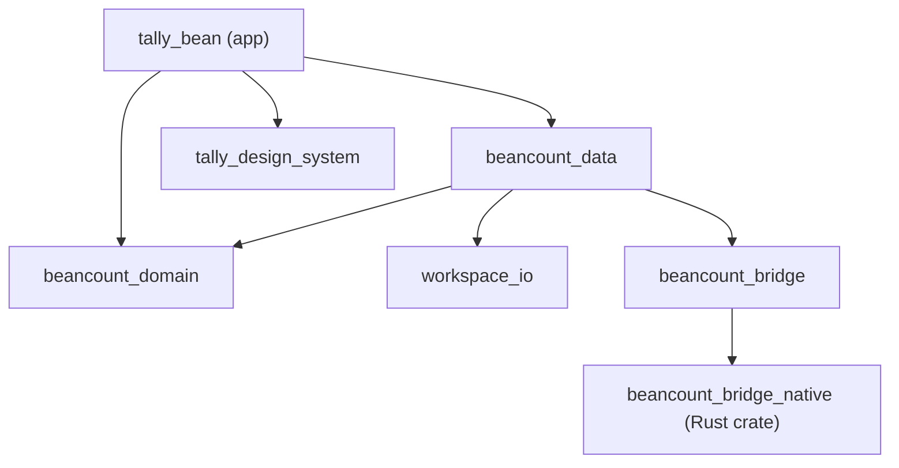
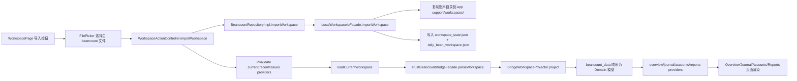

# TallyBean

TallyBean 是一个面向 beancount 账本的 Flutter 移动端工程，采用 `Melos` 维护多 package 仓库，并通过 Rust + Flutter Rust Bridge 实现账本解析与投影。

最后更新：2026-04-18

## 1. 项目简介

- 仓库类型：`Flutter + Melos` Monorepo
- 产品定位：beancount 本地工作区导入、解析、浏览与分析
- 当前目标：先打通工作区导入与核心浏览链路，再逐步补全录入、报表、工具能力
- 读者对象：团队开发者（关注工程结构、模块边界与开发流程）

## 2. 技术栈与版本基线

| 类别 | 组件 / 版本 | 代码依据 |
| --- | --- | --- |
| UI 框架 | Flutter `3.41.6` | `flutter --version` |
| 语言 | Dart `3.11.4` | `flutter --version` |
| 状态管理 | `flutter_riverpod` / `riverpod_annotation` | `pubspec.yaml` |
| 路由 | `go_router` | `pubspec.yaml` |
| Monorepo | `melos` | `pubspec.yaml`, `melos.yaml` |
| 原生解析 | Rust `1.92.0` | `packages/beancount_bridge/rust/rust-toolchain.toml` |
| Rust-Dart 桥接 | `flutter_rust_bridge 2.11.1` | `packages/beancount_bridge/pubspec.yaml`, `packages/beancount_bridge/rust/Cargo.toml` |

## 3. 仓库结构总览

```text
.
├── lib/                             # App 主工程（壳层、功能、共享组件）
│   ├── app/
│   ├── features/
│   └── shared/
├── packages/                        # 本地 package 集合
│   ├── beancount_domain/            # 领域模型与仓储接口
│   ├── beancount_data/              # 仓储实现与 DTO -> Domain 映射
│   ├── workspace_io/                # 本地工作区导入/状态持久化
│   ├── beancount_bridge/            # Dart facade + Rust 解析器
│   └── tally_design_system/         # 设计系统与主题
├── test/                            # 主工程单元 / 组件测试
├── integration_test/                # 集成测试（当前以启动冒烟为主）
├── android/ ios/ macos/ linux/ web/ windows/
├── melos.yaml                       # workspace 与脚本编排
└── pubspec.yaml                     # 主 app 依赖与本地 path 包接入
```

目录重点说明：

- `lib/app`：启动、依赖注入、路由、全局壳层与主题适配
- `lib/features`：按业务域拆分，统一 `application + presentation`
- `lib/shared`：通用格式化、异步状态 UI、跨 feature 小组件
- `packages/*`：通过 path dependency 与 app 解耦；核心业务能力尽量下沉到 package

## 4. 分层架构说明

### 4.1 App 壳层（`lib/app`）

- 启动入口：`lib/main.dart` -> `MyApp`
- 配置注入：`AppConfig`（默认 `useDemoData = false`）
- DI 核心：`beancountRepositoryProvider` 统一向上暴露 `BeancountRepository`
- 路由组织：`GoRouter + StatefulShellRoute.indexedStack`
- 壳层容器：`AppShell` + `BottomNavShell` + 全局 FAB（记一笔）

### 4.2 Feature 层（`lib/features`）

- 结构约定：`application`（providers）+ `presentation`（pages/widgets）
- 已落地域：`workspace / overview / journal / accounts / reports / settings / compose_transaction`
- 页面统一先读取 `currentWorkspaceProvider`，再决定展示数据页或 `WorkspaceGateView`

### 4.3 Shared 层（`lib/shared`）

- 格式化器：金额、日期、分录展示文本
- 通用异步视图：`AsyncLoadingView` / `AsyncErrorView`
- 工作区门禁组件：`WorkspaceGateView`

### 4.4 本地 packages 层（`packages/*`）

- `beancount_domain` 定义稳定领域接口
- `beancount_data` 实现仓储并协调 bridge 与 workspace IO
- `workspace_io` 负责账本目录复制、状态持久化与最近工作区
- `beancount_bridge` 负责 Rust 解析与投影
- `tally_design_system` 承载主题与复用 UI 组件

## 5. 包职责表（职责与边界）

| Package | 职责 | 对外暴露 | 不负责内容 |
| --- | --- | --- | --- |
| `beancount_domain` | 领域模型与仓储抽象 | `BeancountRepository`、`Workspace`、`JournalEntry` 等 | IO、解析、UI |
| `beancount_data` | 仓储实现、桥接 DTO 到领域对象 | `createLocalBeancountRepository`、`createDemoBeancountRepository` | Widget、路由 |
| `workspace_io` | 导入本地账本目录、保存当前/最近工作区状态 | `WorkspaceIoFacade`、`LocalWorkspaceIoFacade` | 账本语法解析 |
| `beancount_bridge` | Rust 运行时调用、解析结果投影、桥接 DTO | `BeancountBridgeFacade`、`RustBeancountBridgeFacade` | UI 状态管理 |
| `tally_design_system` | 主题 tokens 与复用组件 | `buildTallyTheme`、`TallyMetricCard` 等 | 业务数据来源 |

## 6. 包依赖图



## 7. 关键数据流（导入 `.beancount` 到 UI）



## 8. 路由与页面映射

当前显式注册路径如下（见 `lib/app/router/app_router.dart`）：

| Path | Route Name | 页面 | 入口方式 |
| --- | --- | --- | --- |
| `/workspace` | `workspace` | 工作区页 | 默认启动页（`useDemoData=false`）或设置页跳转 |
| `/overview` | `overview` | 首页总览 | 底部导航 |
| `/journal` | `journal` | 明细页 | 底部导航 |
| `/accounts` | `accounts` | 账户页 | 底部导航 |
| `/reports` | `reports` | 统计页 | 底部导航 |
| `/settings` | `settings` | 设置页 | 底部导航 |
| `/compose-transaction` | `compose-transaction` | 新建交易页 | 全局 FAB `记一笔` |

补充说明：

- `AppRouteNames.rootPath = "/"` 当前未单独注册页面。
- 除 `workspace` 外，大部分页面都受工作区状态门禁控制（无工作区或 `issuesFirst` 时跳转提示 UI）。

## 9. 开发与测试命令

在仓库根目录执行：

```bash
# 1) 安装依赖
flutter pub get

# 2) 全仓静态检查（melos.yaml 脚本）
flutter pub run melos run analyze

# 3) 全仓测试（melos.yaml 脚本）
flutter pub run melos run test

# 4) 主工程测试
flutter test

# 5) 集成测试（当前为 app 启动冒烟）
flutter test integration_test
```

命令说明：

- `melos run` 当前已定义脚本：`analyze`、`test`。
- 如果本机 `flutter` 不在 PATH，可使用绝对路径（示例：`~/devtools/flutter/bin/flutter`）。

## 10. Rust / FRB 维护说明

### 10.1 关键文件

- FRB 配置：`packages/beancount_bridge/flutter_rust_bridge.yaml`
- Rust crate：`packages/beancount_bridge/rust/`
  - API 入口：`src/api/mod.rs`
  - 解析器：`src/parser/mod.rs`
  - FRB Rust 侧生成文件：`src/frb_generated.rs`
- Dart 侧桥接：`packages/beancount_bridge/lib/src/rust/`
  - 运行时包装：`rust_ledger_runtime.dart`
  - FRB Dart 侧生成文件：`frb_generated.dart`、`frb_generated.io.dart`、`frb_generated.web.dart`

### 10.2 运行关系

- UI/Repository 只依赖 `BeancountBridgeFacade` 抽象。
- `RustBeancountBridgeFacade` 调 `RustLedgerRuntime.parseWorkspace` 获取原始快照。
- `BridgeWorkspaceProjector` 将 Rust 快照投影为 Bridge DTO，再由 `beancount_data` 映射为 Domain 模型。

### 10.3 常见维护与排障点

- `validateWorkspace` / `buildReports` 依赖 `parseWorkspace` 的缓存结果；若未先解析，对应结果会为空。
- `rust_ledger_runtime.dart` 在测试环境会尝试多条动态库回退路径（`.dart_tool/lib`、`rust/target/*`）。
- 解析器对 `include` 有工作区根目录约束，超出根目录或循环 include 会产生阻塞问题。

## 11. 当前实现边界（现状）

- 交易录入页（`compose_transaction`）目前是结构骨架，尚未接入真实表单提交流程。
- 报表 key 映射在 `beancount_data` 已预留四类（`income_expense/assets/account_contribution/time_comparison`），但 Rust 投影当前默认只稳定产出 `income_expense`。
- Rust 解析器已支持 `open/close/price/balance/transaction` 主链路；对部分指令采用“跳过并记录诊断”策略（如不支持指令、`include` 通配符）。
- 设置页“高级工具”入口（周期记账、数据导入导出、纯文本编辑、版本控制）目前为 UI 占位，不代表完整功能已接入。

## 12. 扩展指引（新增 Feature / Package）

### 12.1 新增 Feature（建议流程）

1. 在 `lib/features/<feature_name>/` 下创建 `application` 与 `presentation`。
2. 在 `application` 暴露 provider，优先依赖 `BeancountRepository` 抽象。
3. 在 `presentation/pages` 新增页面并复用 shared 异步/门禁组件。
4. 在 `lib/app/router/app_router.dart` 注册路由；如为主导航页面，补充 `StatefulShellBranch`。
5. 为关键行为补充测试（至少 widget 测试 + 必要 provider/仓储测试）。

### 12.2 新增 Package（建议流程）

1. 在 `packages/` 下创建新包，定义清晰边界与最小公开 API。
2. 如需纳入统一检查/测试，更新 `melos.yaml` 的脚本遍历列表。
3. 若 app 直接使用，更新根 `pubspec.yaml` 增加 path dependency。
4. 在 README 的“包职责表”和“依赖图”同步更新，确保结构文档与代码一致。
